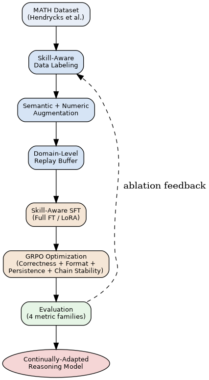
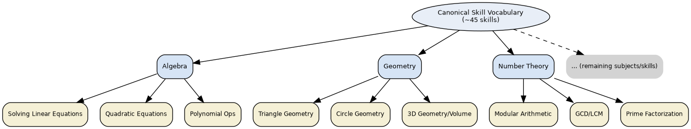
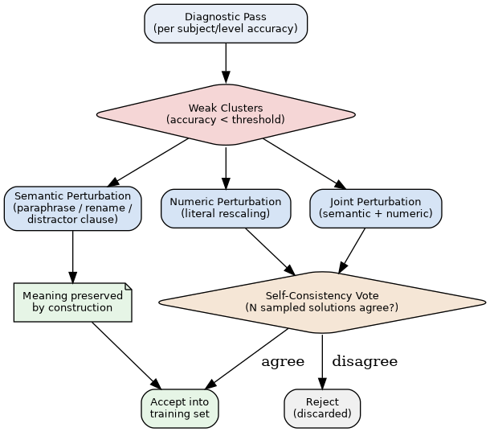
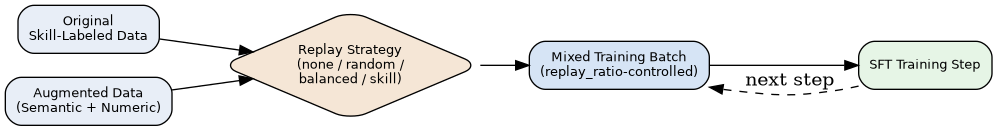
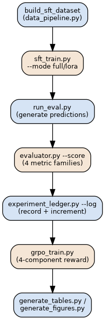

# SMART: Skill-aware Mathematical Adaptation with Replay and Reinforcement Training

[](https://github.com/Husnain-Amjad/SMART/actions/workflows/ci.yml)
[](LICENSE)

**Jump to:**
[Introduction](#introduction) ·
[Usage Guide](#usage-guide) ·
[Local GPU (SSH)](#local-gpu-ssh) ·
[Cluster](#cluster) ·
[Colab](#colab) ·
[Repository Structure](#repository-structure) ·
[Contributing](#contributing) ·
[Troubleshooting](#troubleshooting)

---

## Introduction

**SMART** is a continual-adaptation framework for teaching large language
models Olympiad-level mathematical reasoning without sacrificing previously
learned reasoning ability. It integrates skill-aware data labeling, targeted
semantic/numeric data augmentation, replay-based continual fine-tuning (Full
Fine-Tuning or LoRA), and GRPO reinforcement learning into a single, tested
pipeline — supporting NVIDIA GPUs, multi-GPU clusters, and Google Colab.

Standard fine-tuning on math problems teaches a model to produce answers, but
gives it no way to name *how* it's reasoning, no defense against forgetting
what it already knew once adapted further, and no direct pressure toward
consistent, well-formatted, persistent reasoning. SMART addresses each of
these with a dedicated pipeline stage:



| Stage | What it does |
|---|---|
| 1. Skill-Aware Dataset Construction | Tags each solution step with the skill it uses, against a canonical skill vocabulary |
| 2. Supervised Fine-Tuning | Trains the base model on skill-labeled data — Full FT or LoRA |
| 3. Diagnosis | Identifies which (subject, difficulty) clusters are still weak |
| 4. Data Augmentation | Generates targeted semantic and numeric variants of weak-cluster problems |
| 5. Replay-Based Fine-Tuning | Retrains with augmented + original data, mixed via a replay strategy |
| 6. GRPO Reinforcement Learning | Optimizes correctness, format, persistence, and reasoning stability |
| 7. Evaluation | Scores every checkpoint on four metric families, logged to a persistent ledger |
| 8. Test-Set Skill Labeling | Extends skill evaluation to held-out data, for a genuine generalization check |

**Skill taxonomy** — each of the ~45 canonical skills is organized under one
of the 7 MATH subjects:



**Augmentation mechanism** — weak clusters identified by diagnosis are
targeted with semantic (meaning-preserving) and numeric (self-consistency-
verified) perturbation:



**Replay mechanism** — original and augmented data are mixed via a
configurable strategy to directly counter catastrophic forgetting:



**Training pipeline** — the full sequence from raw data to a continually-
adapted, RL-optimized model:



**Hyperparameter selection and statistical significance** — two methodology
points worth stating explicitly, since both are easy to get wrong or leave
implicit:

- *Hyperparameters* are chosen via `hyperparameter_search.py`, a small,
  documented grid search on a held-out validation subset carved from the
  **train** split (never the test split, so final reported numbers are never
  used, even indirectly, to select settings): `python
  hyperparameter_search.py --model <model> --sft-data outputs/sft_data.jsonl
  --grid lr=1e-5,2e-5 lora_r=8,16,32 --train-size 200 --val-size 100`. It
  reports every configuration's validation accuracy, ranked, and prints a
  ready-to-cite methodology sentence for the paper's Implementation Details.
- *Comparisons between runs* use McNemar's exact paired test
  (`evaluator.py --compare --run-detailed name=path/to/detailed.jsonl`) —
  the statistically correct test here, since every run scores the *same*
  test problems. It reports a real p-value from the discordant-pair counts,
  not just a coarse standard-error heuristic. That older heuristic still
  runs alongside it as a secondary per-cluster diagnostic, but the paired
  test is what should be cited as "statistical significance" results.

See [Usage Guide](#usage-guide) below for exactly how to run every stage
shown above, on your specific environment.

## Usage Guide

Each subsection below is a single, copy-paste block — replace the
placeholders (`<PAT_TOKEN>`, model name, server address) and run as-is.

### Local GPU (SSH)

```bash
# 1. Connect to your GPU server
ssh <your-username>@<server-address>

# 2. Clone the repository (replace <PAT_TOKEN> with your GitHub Personal Access Token)
git clone https://<PAT_TOKEN>@github.com/Husnain-Amjad/SMART.git
cd SMART

# 3. Set up the environment (installs everything needed: core packages,
#    CUDA-matched PyTorch, vLLM, torchao - fully automatic, nothing else to
#    install by hand. Check the PyTorch install line inside this script
#    matches your CUDA version first - see nvidia-smi - if not, edit that
#    one line before running)
bash setup_environment.sh

# 4. Run inside tmux, so a dropped SSH connection doesn't kill a multi-hour run
tmux new -s smart_experiment

# 5. Run the full experiment for one model, then generate the combined report
bash run_full_experiment.sh "Qwen/Qwen2.5-Math-1.5B-Instruct"
python generate_all_reports.py --ledger outputs/experiment_ledger.jsonl --out_dir outputs/report
```

Detach from tmux without stopping the run: `Ctrl-b` then `d`. Reattach later
with `tmux attach -t smart_experiment`.

**To run every target model instead of just one**, use `run_all_models.sh` in
place of step 5's `run_full_experiment.sh` line — every model is listed
explicitly inside that one file:
```bash
bash run_all_models.sh
python generate_all_reports.py --ledger outputs/experiment_ledger.jsonl --out_dir outputs/report
```
Or run a single model's dedicated script directly: `bash
run_01_Qwen_Qwen2_5-Math-1_5B.sh` (see the repository root for the full
`run_0N_...sh` list, one per target model). Every output path and ledger
`run_id` is namespaced by model, so results never collide, and **every
intermediate checkpoint** — not just the final one — is evaluated and logged
separately, enabling an accuracy-vs-epoch retention curve afterward.

### Cluster

Everything above applies identically on a cluster compute node reached via
SSH. Two cluster-specific additions:

**If your cluster uses a job scheduler (e.g. SLURM)**, write the job as its
own file and submit it, rather than running interactively:
```bash
git clone https://<PAT_TOKEN>@github.com/Husnain-Amjad/SMART.git
cd SMART
bash setup_environment.sh

cat > smart_job.slurm << 'EOF'
#!/bin/bash
#SBATCH --job-name=smart_experiment
#SBATCH --gres=gpu:1
#SBATCH --time=24:00:00
#SBATCH --output=smart_experiment_%j.log

bash run_all_models.sh
EOF

sbatch smart_job.slurm
```
Adjust `--gres`/`--time`/partition flags inside `smart_job.slurm` to match
your specific cluster's configuration.

**If multiple GPUs are available**, two separate config files handle the two
fine-tuning modes — edit `num_processes` in whichever one you use to match
your node's actual GPU count (`nvidia-smi -L | wc -l`), then launch through
`accelerate` instead of plain `python`:
```bash
# Full fine-tuning (needs FSDP - gradients/optimizer state sharded across GPUs)
accelerate launch --config_file cluster_configs/accelerate_fsdp_full.yaml \
    sft_train.py --model Qwen/Qwen2.5-Math-7B --data outputs/sft_data.jsonl \
    --mode full --output_dir ckpts/qwen7b_full_cluster --save_every_epochs 0.5

# LoRA (DDP is sufficient - small trainable parameter count)
accelerate launch --config_file cluster_configs/accelerate_ddp_lora.yaml \
    sft_train.py --model Qwen/Qwen2.5-Math-7B --data outputs/sft_data.jsonl \
    --mode lora --output_dir ckpts/qwen7b_lora_cluster --save_every_epochs 0.5
```
For multi-node, also set `num_machines` and `machine_rank` (0 on the main
node, 1/2/3... on others) inside the same YAML file, and confirm all nodes
can reach `main_process_ip:main_process_port` before launching.

To train several different models in parallel (one per GPU) instead, pin each
to its own device — no `accelerate` needed for this pattern:
```bash
CUDA_VISIBLE_DEVICES=0 bash run_01_Qwen_Qwen2_5-Math-1_5B.sh &
CUDA_VISIBLE_DEVICES=1 bash run_02_Qwen_Qwen2_5-Math-1_5B-Instruct.sh &
CUDA_VISIBLE_DEVICES=2 bash run_03_Qwen_Qwen2_5-Math-7B.sh &
CUDA_VISIBLE_DEVICES=3 bash run_04_Qwen_Qwen2_5-Math-7B-Instruct.sh &
CUDA_VISIBLE_DEVICES=4 bash run_05_deepseek-ai_deepseek-math-7b-base.sh &
CUDA_VISIBLE_DEVICES=5 bash run_06_deepseek-ai_deepseek-math-7b-rl.sh &
CUDA_VISIBLE_DEVICES=6 bash run_07_AI-MO_NuminaMath-7B-CoT.sh &
wait
```
Verify all intended GPUs are actually busy with `watch -n1 nvidia-smi` — if
only GPU 0 shows activity, a job that needed `accelerate launch` was started
with plain `python`/`bash` instead.

### Colab

```python
# Cell 1 - clone and check the GPU
import os
if os.path.isdir("SMART"):
    %cd SMART
    !git pull
    %cd ..
else:
    !git clone https://<PAT_TOKEN>@github.com/Husnain-Amjad/SMART.git
%cd SMART
!nvidia-smi --query-gpu=name,memory.total,memory.used --format=csv,noheader
```

```python
# Cell 2 - environment (Colab ships a pre-matched torch/CUDA build already -
# don't reinstall torch unless check_environment.py specifically flags it)
!python check_environment.py --install-missing
!pip install -q vllm
!pip install -q --upgrade torchao
import os
os.environ["VLLM_USE_FLASHINFER_SAMPLER"] = "0"   # safe no-op unless your GPU is Blackwell-class
```

```python
# Cell 3 - tiny-sample smoke test (a few minutes on a free-tier T4) - the
# exact same script the full run uses, just capped to 20 training rows and
# 50 test problems, so a pass here guarantees the full run will work too
!bash run_full_experiment.sh "Qwen/Qwen2.5-Math-1.5B-Instruct" 20 50
```

```python
# Cell 4 - inspect results
!python experiment_ledger.py --print --ledger outputs/experiment_ledger.jsonl
!python generate_all_reports.py --ledger outputs/experiment_ledger.jsonl --out_dir outputs/report
```

Colab's local disk (`/content/`) does not persist across disconnects —
anything worth keeping should go to Drive or Hugging Face Hub before the
session ends:
```python
from google.colab import drive
drive.mount('/content/drive')
!python push_artifact.py --path ckpts/<model_slug>/stage1_merged --push_to hf \
    --hf_repo_id <your-hf-username>/<repo-name> --hf_repo_type model
```

## Repository Structure

Flat, no nested docs folder — the only subdirectories are functional
(rendered diagrams, cluster launch configs, an example data file):

| File | What it does |
|---|---|
| `README.md` | This file |
| `IMPLEMENTATION.md` | Technical reference: per-stage implementation details, augmentation rules and verification gates, replay strategies, GRPO reward decomposition, evaluation metrics, training-time diagnostics, statistical methodology |
| `check_environment.py` | Reports installed vs. missing packages; never touches working installs |
| `hardware_utils.py` | Detects A100/H100/ROCm/multi-GPU and recommends settings |
| `requirements.txt` | Complete dependency specification, NVIDIA CUDA primary target — installed in full by `setup_environment.sh` |
| `setup_environment.sh` | One-shot environment setup (installs everything in `requirements.txt`, correctly ordered) |
| `run_full_experiment.sh` | The full experiment ladder (baseline → SFT → 3 augmentation variants → 4 GRPO variants) for one model, with per-model output/ledger namespacing and per-checkpoint logging |
| `run_all_models.sh` | Runs every target model in sequence, then generates the combined report |
| `run_0N_<model>.sh` | Thin, ready-to-run wrapper scripts, one per target model |
| `create_test_skill_labels.sh` | Bash wrapper for `label_test_set_v2.py`, saves to `data/test_skill_labels.jsonl` |
| `data_pipeline.py` | Builds the SFT dataset from skill-labeled data; diagnoses weak clusters; runs semantic/numeric perturbation and multi-solution rejection sampling |
| `templates.py` | Renders raw `{problem, think, solution}` rows into each model's own prompt format at train/eval time |
| `reward_fn.py` | Boxed-answer extraction and symbolic-equivalence checking |
| `determinism.py` | Seeds random/numpy/torch/transformers consistently |
| `storage_utils.py` | Local path handling, plus optional push to Hugging Face Hub or Google Drive |
| `sft_train.py` | Supervised fine-tuning, Full FT or LoRA, with checkpointing, replay strategies, auto-merge |
| `merge_lora.py` | Merges a LoRA adapter checkpoint into a standalone model |
| `grpo_train.py` | GRPO reinforcement learning with a 4-component decomposed reward |
| `run_eval.py` | Generates model predictions on a MATH split |
| `run_augmentation.py` | Connects a live model to the augmentation functions (batched, ROCm-portable) |
| `run_judge_eval.py` | Optional LLM-judge scoring of per-step reasoning validity |
| `run_multi_checkpoint_eval.py` | Evaluates every checkpoint from one training run in a single pass, logging each to the ledger |
| `evaluator.py` | Scores predictions on 4 metric families; cross-run ablation comparison with significance flags |
| `dump_model_template.py` | Inspects a model's real tokenizer/chat-template before you train on it |
| `hyperparameter_search.py` | Small, documented grid search on held-out validation data — replaces ad-hoc tuning with a citable methodology |
| `label_test_create.py` | Lighter-weight test-split skill labeling, hard-constrained to the train vocabulary |
| `label_test_set.py` | 3-pass test-split labeling with an independent judge model |
| `label_test_set_v2.py` | Recommended test-set labeling: one-shot example, judge model, fixer model, semantic canonicalization — matches training-data format exactly |
| `format_test_labels.py` | Repairs/reformats an already-generated test-set skill-label file |
| `generate_all_reports.py` | One command for all diagrams + all ledger-derived tables + all figures together |
| `experiment_ledger.py` | Append-only log of every run: full config + results + increment vs. baseline |
| `generate_tables.py` | Ledger → LaTeX (booktabs) + Markdown tables |
| `generate_figures.py` | Ledger → retention/forgetting curves, skill-wise bar charts |
| `generate_diagrams.py` | Architecture/taxonomy/pipeline diagrams (graphviz) |
| `push_artifact.py` | Push an already-existing local file/model to HF Hub or Drive, standalone |
| `ssh_connect.sh` | Connect/sync/train-in-tmux/download for a remote GPU box |
| `cluster_configs/*.yaml` | Accelerate configs for multi-GPU FSDP (Full FT) and DDP (LoRA) |
| `assets/diagrams/*.png` | Rendered architecture diagrams (regenerate with `generate_diagrams.py`) |
| `data/skill_labels.jsonl.example` | Reference schema for the skill-labeled dataset format |
| `.github/workflows/ci.yml` | CPU-only syntax and logic checks, run on every push/PR |
| `LICENSE`, `CITATION.cff`, `.gitignore` | Standard repo metadata |

## Contributing

- Run `for f in *.py; do python3 -m py_compile "$f"; done` (or let CI do it)
  before opening a PR.
- Test the actual logic you changed with a synthetic-input snippet, not just
  that it imports.
- Keep prompt construction routed through `templates.py`, batch model calls
  rather than looping per-problem, check statistical significance before
  reporting an improvement, and guard CUDA-only dependencies with a
  detection check and graceful fallback.
- Update this README if you change a flag name, default, or file format.

## Troubleshooting

| Symptom | Likely cause |
|---|---|
| `ModuleNotFoundError` anywhere | A core package is missing — run `check_environment.py`, it names the exact missing package |
| `python: command not found` | Try `python3` instead |
| `CUDA out of memory` during SFT/replay/GRPO | Reduce `--per_device_batch_size`, increase `--grad_accum`, or switch to `--mode lora` if on `--mode full` |
| Confusing error about a "3-segment path" or Hugging Face repo id | See `run_augmentation.py`'s `resolve_model_path()` — a deliberately clear error for a local-path-vs-Hub-id mixup, not a real Hugging Face Hub problem |
| Adapter directory won't load in vLLM/transformers | It's adapter-only, not merged — look for `<output_dir>_merged` instead, or run `merge_lora.py` |
| Everything you did on Colab is gone after reopening | Expected — `/content/` doesn't persist. Anything not pushed to Drive/HF is gone |
| `!pip install torch ...` "fixes" one error but breaks everything else on Colab | You reinstalled over Colab's pre-matched CUDA/torch build — restart the runtime, don't reinstall torch unless `check_environment.py` says it's missing |
| Only GPU 0 shows activity on a multi-GPU box | Launched with plain `python`/`bash` instead of `accelerate launch` for a job that needed it |
| vLLM fails with `FlashInfer requires GPUs with smXX or higher` despite a newer card | A known false positive on some Blackwell-generation GPUs — set `VLLM_USE_FLASHINFER_SAMPLER=0` rather than reinstalling anything |
| `flash-attn` install hangs or fails | Not required — `sdpa` is the automatic fallback and is already fast on Ampere/A100 and newer. Skip it, or install `ninja` first if you specifically want it |
| Segfault or hang inside `xet_get`/`hf_hub_download` during a model download, especially under parallel/concurrent downloads | Known bug in Hugging Face's `hf-xet` download backend — `setup_environment.sh` already removes it and disables it by default; if you still hit this, run `pip uninstall -y hf-xet && export HF_HUB_DISABLE_XET=1` manually (the env var alone is reported unreliable in some versions — remove the package too) |
| `evaluator.py`'s skill metrics show near-zero coverage on the test split | Skill labels only cover whatever split you point `--skill-repo`/`--skill-labels-file` at — run `create_test_skill_labels.sh` to extend coverage to test |
| Results differ across machines with the same seed | Expected — floating-point reduction order in matmul/attention kernels differs across GPUs/drivers regardless of seed |
| A run's ledger comparison shows a small, possibly-noise improvement | Check it against standard error: roughly `sqrt(p*(1-p)/n)` for a cluster with `n` problems — `evaluator.py --compare` flags this automatically |
